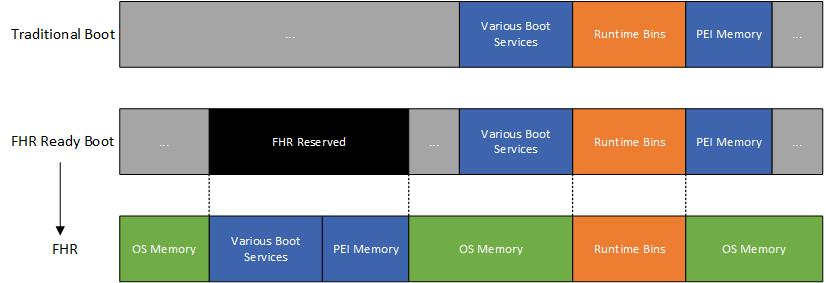

# Firmware Hot Reset Feature

Firmware Hot Reset (FHR) is a feature that allows a platform to reset the CPU
while leaving the DRAM and peripherals in a functioning state. This is primarily
to facilitate updating the firmware on a system while leaving the memory active,
allowing for a more rapid reboot as well as allowing the OS to preserve state such
as virtual machines across the reset.

## Design

To support FHR, UEFI reserve a chunk of memory that may not be reclaimed by the
OS which will be guaranteed to be available for use by UEFI during the FHR. This
region must be large enough to contain __ALL__ reclaimable UEFI memory during
boot to the BDS phase. Additionally, all runtime ranges must be consistent in
their physical address, length, and type between the traditional boot and the
FHR. The generic MU components will ensure proper usage of memory in PEI and DXE,
but requires some logic in the platform to properly initialize PEI memory as well
as handle the actual reset mechanism.

OS reclaimable memory is defined as the following types.

- EfiLoaderCode
- EfiLoaderData
- EfiBootServicesCode
- EfiBootServicesData
- EfiConventionalMemory
- EfiACPIReclaimMemory
- EfiPersistentMemory

### FHR Support Memory Model

On the traditional boot with FHR support, the memory layout will be largely
unchanged with the exception of the new FHR reserved region. This region will be
allocated by the MU components based on the _PcdFhrReservedBlockBase_ and
_PcdFhrReservedBlockLength_ PCDs. This region will only be used for storing some
firmware data during the cold boot. This FHR firmware data is used to preserve
the original memory map to reserve OS memory and ensure compliance, as well as
the location of runtime ranges that must be re-used.

On an FHR resume, all non-runtime memory must be contained to the free pages
within the FHR reserved region. This includes all boot services code/data.
Runtime memory is expected to not move from its previous allocation ranges.
Dynamically allocated runtime memory should leverage the existing memory bins,
which should be significantly over allocated, and statically allocated regions
are expected to be consistent at the platform level. All memory allocations will
be validated during resume and any consistency failure will result in a full
reboot.

